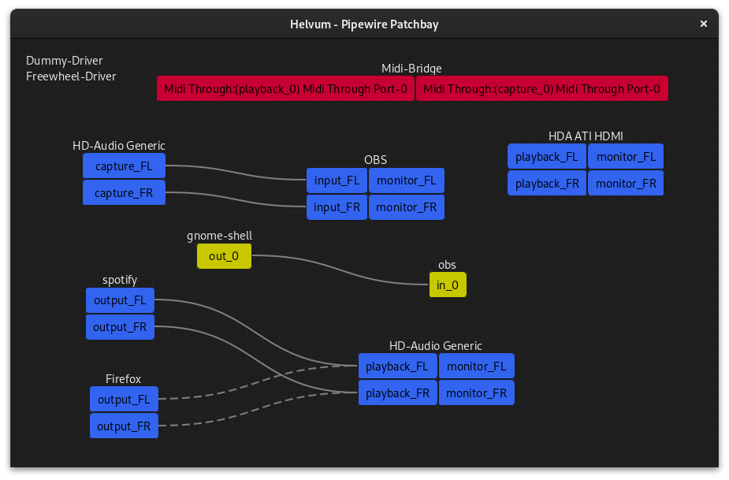

Helvum is a GTK-based patchbay for pipewire, inspired by the JACK tool [catia](https://kx.studio/Applications:Catia).



[](https://repology.org/project/helvum/versions)


# Features planned

- Volume control
- "Debug mode" that lets you view advanced information for nodes and ports

More suggestions are welcome!

# Building

## Via flatpak (recommended)
The recommended way to build is using flatpak, which will take care of all dependencies and avoid any problems that may come from different system configurations.

First, install the required flatpak platform and SDK, if you dont have them already:
```shell
$ flatpak install org.gnome.{Platform,Sdk}//40 org.freedesktop.Sdk.Extension.rust-stable//20.08
```

To compile and install as a flatpak, run
```shell
$ flatpak-builder --install flatpak-build/ org.freedesktop.ryuukyu.Helvum.json
```

You can then run the app via
```shell
flatpak run org.freedesktop.ryuukyu.Helvum
```

## Manually
For compilation, you will need:

- An up-to-date rust toolchain
- `libclang-3.7` or higher
- `gtk-4.0` and `pipewire-0.3` development headers

To compile, run

    $ cargo build --release

in the repository root.
The resulting binary will be at `target/release/helvum`.

# License
Helvum is distributed under the terms of the GPL3 license.
See LICENSE for more information.